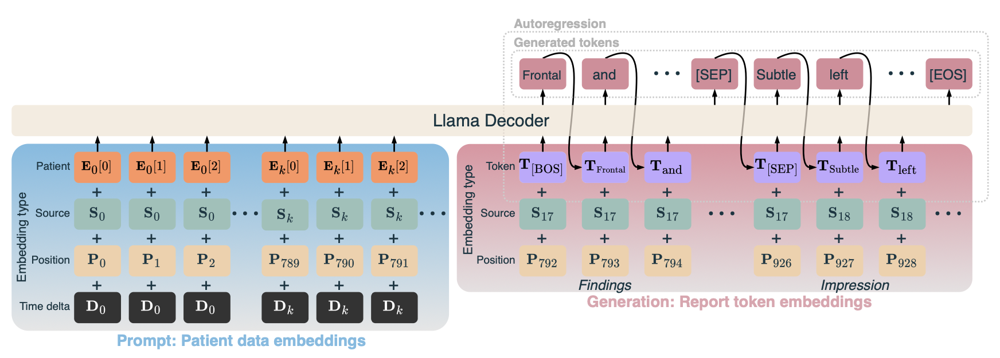
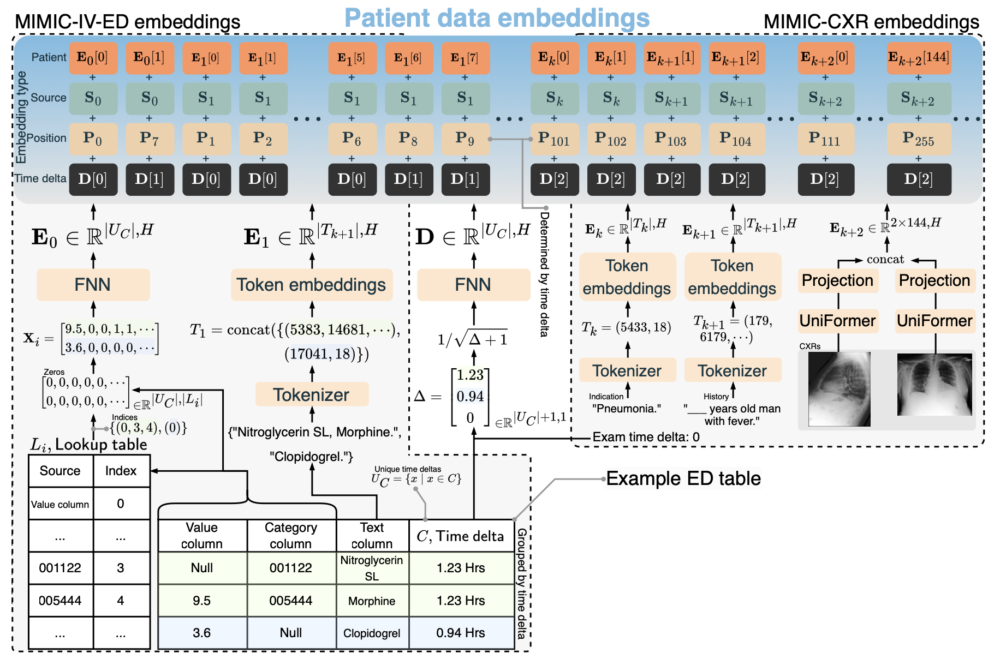
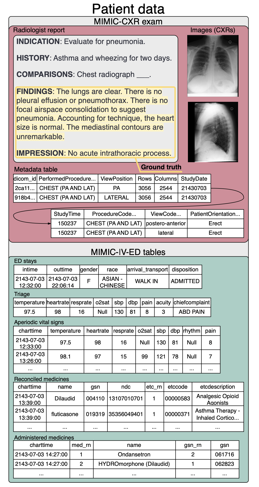

# CXRMate-ED: The Impact of Auxiliary Patient Data on Automated Chest X-Ray Report Generation and How to Incorporate It



*The multimodal language model of CXRMate-ED.*


*The patient data embedding pipeline.*


This is the model and data pipeline for the CXRMate-ED model from: https://arxiv.org/abs/2406.13181v2.

The abstract from the paper:

"This study investigates the integration of diverse patient data sources into multimodal language models for automated chest X-ray (CXR) report generation. Traditionally, CXR report generation relies solely on CXR images and limited radiology data, overlooking valuable information from patient health records, particularly from emergency departments. Utilising the MIMIC-CXR and MIMIC-IV-ED datasets, we incorporate detailed patient information such as vital signs, medicines, and clinical history to enhance diagnostic accuracy. We introduce a novel approach to transform these heterogeneous data sources into embeddings that prompt a multimodal language model; this significantly enhances the diagnostic accuracy of generated radiology reports. Our comprehensive evaluation demonstrates the benefits of using a broader set of patient data, underscoring the potential for enhanced diagnostic capabilities and better patient outcomes through the integration of multimodal data in CXR report generation."

## Hugging Face Hub
The model and data pipeline are available on Hugging Face Hub:

https://huggingface.co/aehrc/cxrmate-ed


*Patient data sources available for an exam from MIMIC-CXR and MIMIC-IV-ED.*


## MIMIC-CXR & MIMIC-IV-ED Dataset:

MIMIC-CXR, MIMIC-CXR-JPG, and MIMIC-IV-ED must be in the same Physio Net directory. E.g.:

```shell
user@cluster:~$ ls /home/user/physionet.org/files
mimic-cxr  mimic-cxr-jpg  mimic-iv-ed
```

### Download MIMIC-CXR-JPG:
Download the MIMIC-CXR-JPG dataset from https://physionet.org/content/mimic-cxr-jpg, e.g.,
```shell
wget -r -N -c -np --user <username> --ask-password https://physionet.org/files/mimic-cxr-jpg/2.1.0/
```
Note that you must be a credentialised user to access this dataset.

### Download the reports from MIMIC-CXR:
MIMIC-CXR-JPG does not include the radiology reports and are instead included with MIMIC-CXR (the DICOM version of the dataset). To download this dataset and avoid downloading the DICOM files (which are very large), use `--reject dcm` with the wget command from https://physionet.org/content/mimic-cxr, e.g, 
```shell
wget -r -N -c -np --reject dcm --user <username> --ask-password https://physionet.org/files/mimic-cxr/2.0.0/
```
Note that you must be a credentialised user to access this dataset.

### Download MIMIC-IV-ED:
Download the MIMIC-IV-ED dataset from https://physionet.org/content/mimic-iv-ed, e.g.,
```shell
wget -r -N -c -np --user <username> --ask-password https://physionet.org/files/mimic-iv-ed/2.2/
```
Note that you must be a credentialised user to access this dataset.

### Prepare the dataset:
Run the [prepare_dataset.ipynb](https://github.com/aehrc/anon/blob/main/prepare_dataset.ipynb) notebook and change the paths accordingly.

Or, run the following:
```python
import transformers

# Paths:
physionet_dir = '/.../physionet.org/files'  # Where MIMIC-CXR, MIMIC-CXR-JPG, and MIMIC-IV-ED are stored.
database_dir = '/.../database/cxrmate_ed'  # The Hugging Face dataset will be saved here.

# Prepare the Hugging Face MIMIC-CXR & MIMIC-IV-ED dataset:
model = transformers.AutoModel.from_pretrained('aehrc/cxrmate-ed', trust_remote_code=True)
model.prepare_data(physionet_dir=physionet_dir, database_dir=database_dir)
```

#### Inference example:

```python
import torch
import transformers

# Device and paths:
device = 'cuda'

# Download model checkpoint:
model = transformers.AutoModelForCausalLM.from_pretrained('aehrc/cxrmate-ed', trust_remote_code=True).to(device=device)
tokenizer = transformers.PreTrainedTokenizerFast.from_pretrained('aehrc/cxrmate-ed')

# Get the Hugging Face MIMIC-CXR & MIMIC-IV-ED test set:
test_set = model.get_dataset(database_dir=database_dir, test_set_only=True)

# Get an example, add mini-batch dimension and move to device:
example = test_set[0]
example = {k: v.to(device).unsqueeze(0) if isinstance(v, torch.Tensor) else [v] for k, v in example.items()}  # Add mini-batch dimension and move to device.

# Convert the patient data in the batch into embeddings:
inputs_embeds, attention_mask, token_type_ids, position_ids, bos_token_ids = model.prepare_inputs(tokenizer=tokenizer, **example)
    
# Generate reports:
output_ids = model.generate(
    input_ids=bos_token_ids,
    decoder_inputs_embeds=inputs_embeds,
    decoder_token_type_ids=token_type_ids,
    prompt_attention_mask=attention_mask,
    prompt_position_ids=position_ids,
    special_token_ids=[tokenizer.sep_token_id],
    max_length=256,
    num_beams=4,
    return_dict_in_generate=True,
)['sequences']

# Findings and impression section:
findings, impression = model.split_and_decode_sections(output_ids, [tokenizer.sep_token_id, tokenizer.eos_token_id], tokenizer)
for i,j in zip(findings, impression):
    print(f'Findings:\t{i}\nImpression:\t{j}\n\n')

```

## Generated reports

Generated reports (findings and impression sections) for the test set are provided in [`mimic_cxr_test_set_generated_reports`](https://github.com/aehrc/anon/blob/main/mimic_cxr_test_set_generated_reports.csv).

## Environment

The used packages can be found in `requirements.txt`.

A virtual environment can be created via:
```shell
python -m venv venv
source venv/bin/activate
python -m pip install --upgrade pip
python -m pip install --upgrade -r requirements.txt
```

## Training

Training is performed using [`dlhpcstarter`](https://github.com/csiro-mlai/dl_hpc_starter_pack) and [PyTorch Lightning](https://lightning.ai).

There are three stages of training. The first two are with teacher forcing, with the last stage using reinforcement learning.

First, configure the paths at config/paths.

#### Stage 1: Training on CXRs

```shell
dlhpcstarter -t cxrmate_ed -c config/stage_1 --train --test --trial 0
```

Note: as the decoder/language model is randomly initialised, some training runs may not converge. Try multiple training runs to get around this (e.g., `--trial 0`, `--trial 1`, `--trial 2`, etc.).

#### Stage 2: Training on CXRs + patient data embeddings

Once stage 1 has finished, it can be used to warm-start the training on patient data embeddings:

```shell
dlhpcstarter -t cxrmate_ed -c config/stage_2 --train --test --trial 0
```

#### Stage 3: Reinforcement learning with self-critical sequence training

Once stage 2 has finished, it can be used to warm-start reinforcement learning:

```shell
dlhpcstarter -t cxrmate_ed -c config/stage_3 --train --test --trial 0
```

Note that four GPUs are used with [DDP](https://lightning.ai/docs/pytorch/stable/accelerators/gpu_intermediate.html#distributed-data-parallel) during this stage. This can be modified in config/stage_3.yaml.
